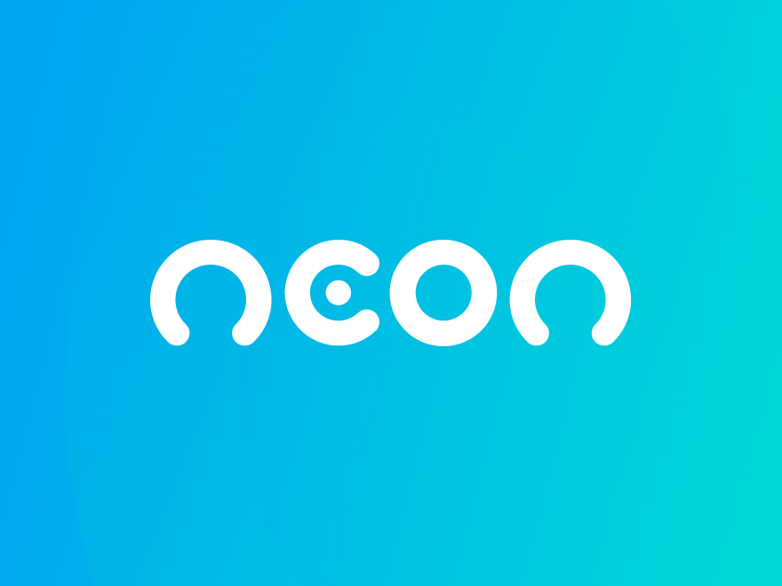

<h1 align="center">
  <br>
  <a href="#"></a>
  <br>
  Banco Neon Redesign
  <br>
</h1>

<h4 align="center">Redesign do banco neon, desenvolvimento com intuito de aprendizagem, layout disponibilizado pelo <a href="https://codeboost.com.br/" target="_blank">codeboost</a>.</h4>

<p align="center">
    
      
      
      

</p>

<p align="center">
  <a href="#layout">Layout</a> •
  <a href="#features">Features</a> •
  <a href="#como-usar">Como usar</a> •
  <a href="#download">Download</a>
</p>


## Layout
O layout pode ser acessado [clicando aqui](https://www.figma.com/file/mZPqWqcj4l7SwDTVpOxGh7/Projeto-Web---Banco-Neon-Redesign-(Copy)?type=design&node-id=1-21&mode=design&t=Y3Kchxd8eM2JSYKe-0)

## Features

- Em construção
- Em construção
- Em construção
- Em construção

## Como usar

Em construção

```bash

# Em construção
$ Em construção

```

> **Nota**
> Em construção

## Download

Em construção.

## Licença

MIT

---
